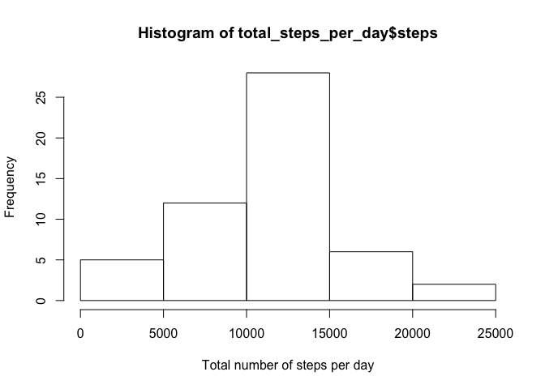
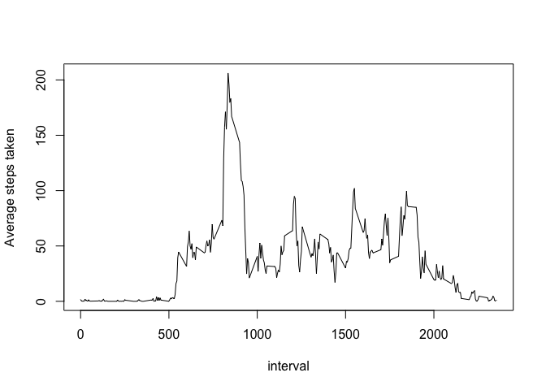
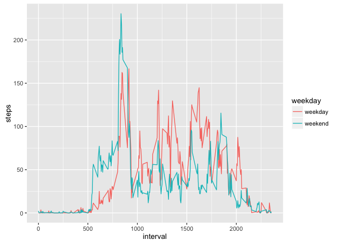

# Reproducible Research: Peer Assessment 1


## Loading and preprocessing the data
Load the data and process date value.

```r
data <- read.csv("activity.csv")
data$date <- as.Date(data$date, "%Y-%m-%d")
```


## What is mean total number of steps taken per day?
Calculate the total number of steps taken per day, plot histogram of the total number of steps taken each day. Calculate the mean and median of the total number of steps taken per day.

```r
total_steps_per_day <- aggregate(steps~date, data, sum)
hist(total_steps_per_day$steps, xlab = "Total number of steps per day")
```

<!-- -->

```r
mean_steps <- mean(total_steps_per_day$steps, na.rm = TRUE)
median_steps <- median(total_steps_per_day$steps, na.rm = TRUE)
```
The mean total number of steps taken per day is 1.0766189\times 10^{4}. The median total number of steps taken per day is 10765.

## What is the average daily activity pattern?
Make a time series plot of the 5-minute interval (x-axis) and the average number of steps taken, averaged across all days (y-axis).

```r
avg_steps_interval <- aggregate(steps~interval, data, mean, na.rm = TRUE)
plot(avg_steps_interval$interval, avg_steps_interval$steps, type = "l", xlab = "interval",
     ylab = "Average steps taken")
```

<!-- -->

```r
where_max <- avg_steps_interval$interval[which.max(avg_steps_interval$steps)]
```
The 835 5-minute interval, on average across all the days in the dataset, contains the maximum number of steps. 

## Imputing missing values
Calculate and report the total number of missing values in the dataset. Using the mean for that 5-minute interval to fill in missing values. The new data set with missing value filled in is called new_data.

```r
na_num <- sum(is.na(data$steps))
new_data <- transform(data, steps = ifelse(is.na(data$steps),avg_steps_interval$steps[match(data$interval, avg_steps_interval$interval)], data$steps))
```

The total number of missing values in data is 2304. 


```r
new_total_per_day <- aggregate(steps~date, new_data, sum)
new_mean <- mean(new_total_per_day$steps)
new_median <- median(new_total_per_day$steps)
mean_dif <- new_mean - mean_steps
median_dif <- new_median - median_steps
```
The mean total number of steps of the new dataset is 1.0766189\times 10^{4}, the median is 1.0766189\times 10^{4}. The mean difference to that from part one is 0. The median difference to part one is 1.1886792. The new mean is the same as that from part one, the median has slightly increased. 

## Are there differences in activity patterns between weekdays and weekends?
Create a new factor variable weekday in the dataset with two levels – “weekday” and “weekend” indicating whether a given date is a weekday or weekend day.

```r
new_data$weekday <- ifelse(weekdays(new_data$date) %in% c("Saturday", "Sunday"), "weekday", "weekend")
```
Make a plot: x-axis is the number of 5-minutes interval, y-axis is average number of steps, averaged across all weekday days or weekend days.

```r
avg_interval_weekday <- aggregate(steps~interval+weekday, new_data, mean)
library(ggplot2)
ggplot(avg_interval_weekday, aes(interval, steps, col = weekday)) +
  geom_line()
```

<!-- -->

